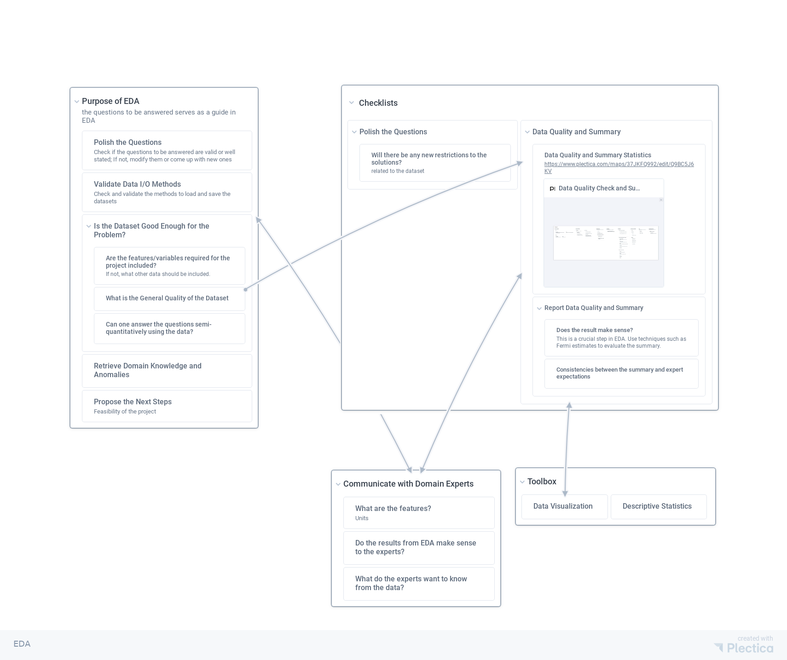
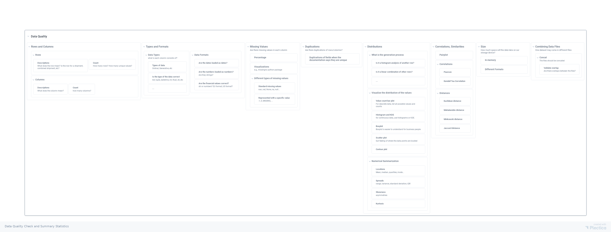


The scope of exploratory data analysis is not universally defined. Some of the contents discussed here may have crossed the line. The whole modeling process is never decoupled anyway.


Data wrangling is mostly guided by the exploratory data analysis (EDA). In other words, the data cleaning process should be mostly guided by questions from business and stakeholder or out of curiosity.

There are three key components in EDA.
- Clearly state the purpose of this EDA.
  - Are we asking the right question?
  - Does the dataset fit in memory or shall I use distributed preprocessing?
  - Is the dataset good enough to solve the problem?
  - Is there anything we already know from the experts?
  - What are the next steps after EDA?
  - ...
- Go through a checklist and report results. Most elements on the checklist is dynamic and should be generated by some questions you need to answer.
  - Polish the Questions
  - Data Quality and Summary
  - ...
- Communicate with domain experts or stakeholders and yourself.
  - Do the results from EDA make sense to the experts?
  - What do the experts want to know from the data?

This is an iteration process. One could get start from any point and iterate the cycle to reach a certain satisfaction.

For data quality checks, we have a somewhat standard checklist to go through. It is not a complete checklist. In this process, more questions will pop out, and one also should attend to these questions as part of the checklist.

## The Checklist



