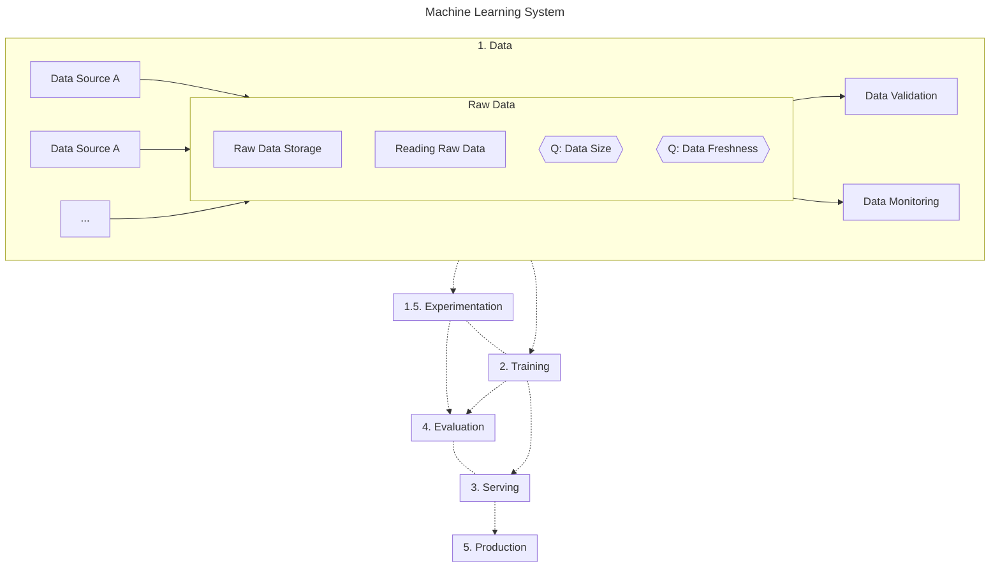

## Evaluation

Evaluation is crucial to a production machine learning system.

- Online
  - Guardrails and real time monitoring
  - KPIs
  - Overarching metrics
- Offline
  - KPIs
  - Performance of each component of the system
  - Bucketing
  - Simulating use cases

## Production

- Monitoring
  - System bias
    - Pricing system recommending higher prices for an auction process.

